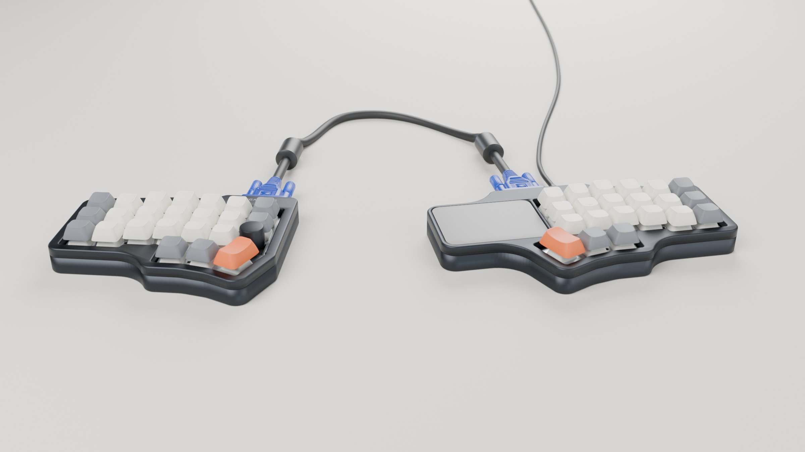
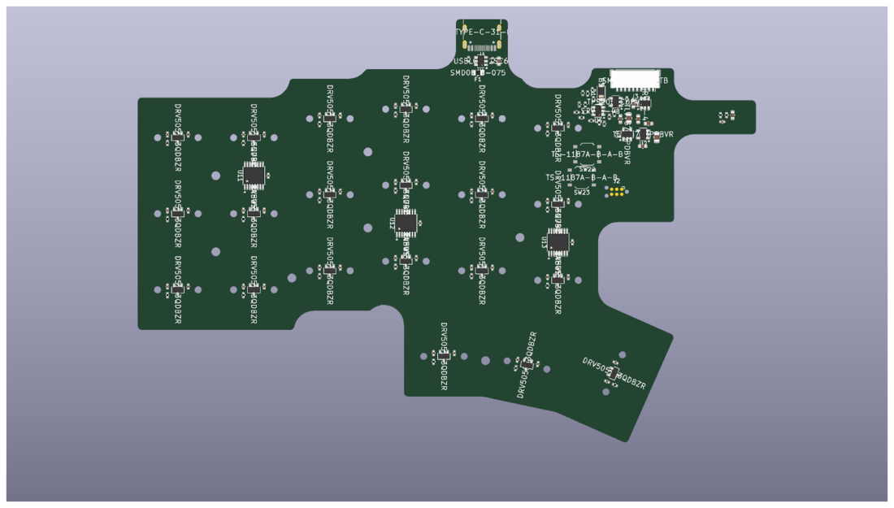

# VGACorne

A hall-effect (magnetic switch) split **Corne** with **one microcontroller** and a
**VGA cable** between the halves, designed for a gasket-mounted CNC aluminium case
with poron or silicone dampening.



<sub>Rendered from the rev 0.1 design files by `hardware/render.py`. The case, plate and key positions are the real geometry; keycaps, switches and cables are stand-ins.</sub>

## The idea in one paragraph

The left half has no MCU. It is just hall sensors, three 8:1 analog
multiplexers and a small buffer. On the right half, the MCU sits on a small
**module soldered flat under the trackpad** and steps all six muxes
with the same three select lines. It reads the left half's three mux outputs
over the VGA cable's three 75 Ω coax pairs (the R, G and B lines), which were
built to carry analog signals. The select lines ride HSYNC, VSYNC and DDC-SDA,
and +5 V rides pin 9. Every pin keeps its normal VGA role, so plugging a half
into a monitor by mistake does no harm. The right half also carries the USB-C
and an optional **trackpad** right beside Y/H/N: a 65 × 49 mm Azoteq TPS65 by
default, or a 40 mm Cirque. The left half has a **mouse column** beside T/G/B:
right- and left-click keys above a **rotary encoder** knob, read over the same
cable through the muxes' spare channels.

Two MCU modules are designed. The **AT32F405** runs
[libhmk](https://github.com/peppapighs/libhmk) at 8 kHz (rapid trigger,
per-key actuation, the [hmkconf](https://hmkconf.com) web configurator). The
**STM32F446** runs QMK or libhmk at 1 kHz.

## Status

**Rev 0.1: routed except a few spots on the main board ([TODO](TODO.md)). Not fabricated.**

| Part | State |
|---|---|
| Architecture, VGA link pinout, power budget | Done: [docs/architecture.md](docs/architecture.md) |
| Schematics (main, satellite, VGA daughterboard, 2 MCU modules) | Done. KiCad 10, ERC clean |
| PCBs | All placed and DRC clean, with module edge pads verified pin-for-pin against the landing pads. VGA daughterboard, both (4-layer) MCU modules and the satellite **routed**. Main board autorouted except four spots and the USB pair, **to finish by hand** ([TODO](TODO.md)) |
| Firmware | libhmk `keyboard.json` per module, traced from the schematics. **Both compile** (AT32 33 KB, F446 37 KB); no rotary encoder under libhmk |
| QMK | F446 module: hall-effect matrix with actuation + rapid trigger, the rotary encoder and the optional trackpad. **Builds** (36.8 KB) and passes host tests; VIA not yet |
| Plate (aluminium DXF + FR4 KiCad board), foams, case plan | Done: [docs/mechanical.md](docs/mechanical.md) |
| 3D case | Done: tray + frame STEP per half, fit-checked against the boards ([mechanical.md](docs/mechanical.md#3d-case)) |



## Repository layout

```
TODO.md               what's left: the main board's last routing, then firmware and case
docs/
  architecture.md     electrical design, VGA link, power, firmware mapping, decisions
  mechanical.md       stack-up, plate/gaskets/foam (poron or silicone), aluminium case rules
  bring-up.md         ordering, assembly, first power-up, flashing, calibration
  sensors.md          Hall/TMR sensor options and the field the common HE switches give
hardware/
  generate.py         regenerates everything below (see hardware/README.md)
  vgacorne/           the generator: layout, circuits, schematic/PCB writers, checks
  lib/                project symbols/footprints (AT32F405RCT7, HE switch, M2 standoff...)
  kicad/{main,satellite,link,module_at32,module_f446}/   KiCad 10 projects
  mechanical/         plate, foam and case-plan DXFs (+ SVG previews), FR4 plate boards, case STEP files
  bom/                grouped BOM CSVs
firmware/libhmk/keyboards/vgacorne_{at32,f446}/   drop-in libhmk keyboards, one per MCU module
firmware/qmk/keyboards/vgacorne/                  QMK keyboard (STM32F446 module) + host tests
```

## Quick start

```sh
uv venv --system-site-packages --python /usr/bin/python3 .venv   # needs KiCad's pcbnew module
uv pip install --python .venv/bin/python shapely ezdxf pydantic
.venv/bin/python hardware/generate.py check       # ERC, DRC + parity, netlist intent, firmware config
```

Open `hardware/kicad/main/vgacorne-main.kicad_pro` in KiCad 10 to route. See
[hardware/README.md](hardware/README.md) for which outputs are regenerated and
which are yours to edit.

## Key decisions

- **One MCU, analog link.** A 3-select, 3-analog link fits the VGA cable, and it
  avoids a second MCU, split-sync firmware and the extra latency on the slave
  half. See [architecture](docs/architecture.md#why-an-analog-link).
- **MCU on a castellated module**, soldered flat to the main PCB under the
  trackpad, so it takes no space in the case. You choose the module when you
  build: AT32F405RCT7 for libhmk at 8 kHz (the HE60 reference board's MCU), or
  STM32F446RET6 for QMK. The two chips share a pin map, so both modules use the
  same signals. See [architecture](docs/architecture.md#mcu-modules).
- **DRV5055A3 sensors on the PCB underside**, read through the board as on the
  HE60. Other sensors are drop-in with a firmware polarity/calibration change.
  See [sensors](docs/sensors.md) for the options, including TMR.
- **Rigid plate+PCB sandwich, gasket mounted.** HE switches aren't soldered, so
  M2 standoffs lock the plate-to-sensor distance. The whole sandwich then floats
  on poron or silicone gaskets.
- **MCU, USB and trackpad on the right half.** The optional trackpad sits
  flush right beside Y/H/N, on the MCU module's own I2C bus, so the VGA cable
  carries only the keyboard link. `hardware/vgacorne/trackpad.py` picks the
  pad: an Azoteq TPS65 (multi-touch, 65 × 49 mm, landscape) or a 40 mm Cirque
  Pinnacle. QMK only. See [architecture](docs/architecture.md#trackpad-optional).
- **Mouse buttons and a rotary encoder on the left half**, for the hand that
  isn't on the trackpad. They fill the satellite muxes' three spare channels;
  the encoder's two contacts share one channel as four voltage levels. See
  [architecture](docs/architecture.md#mouse-column-left-half).
- **The VGA connector lives on the case, not the PCB.** A small vertical
  daughterboard is screwed to the aluminium wall by the DE-15's own screwlocks,
  so cable tug never reaches the gasket-mounted sandwich.

## Credits and references

- Key geometry: [foostan/crkbd](https://github.com/foostan/crkbd) (Corne v4)
- HE reference design and firmware: [peppapighs/HE60](https://github.com/peppapighs/HE60),
  [peppapighs/libhmk](https://github.com/peppapighs/libhmk)
- Inspiration: [Lucca 58HE](https://github.com/Maka8295/Lucca-58HE)
