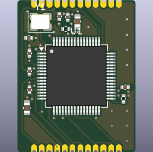
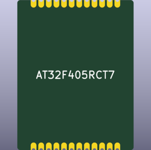

# Architecture

## Block diagram

```
 RIGHT HALF (main PCB = carrier)                            LEFT HALF (satellite PCB)
 ──────────────────────────────                             ──────────────────────────
 21 × DRV5055 ─► 3 × SN74LV4051 ─► ADC_L_A..C ┐             23 × DRV5055 ─► 3 × SN74LV4051
                     ▲ MUX_S0..S2             │                               ▲ S0..S2   │ A/B/C
                     │                        ▼                               │          ▼
 USB-C ─► ESD ─► ┌─ J4 ═ MCU module (soldered) ──┐ ◄─ ADC_R ◄─ 100 Ω ◄──┐      │     TLV9064 ×3
   │             │  AT32F405 (libhmk, 8 kHz)  or │                      │      │     (followers)
   │             │  STM32F446 (QMK / libhmk)     │ ─ MUX_S ─► 470 Ω ─┐  │      │          │ 75 Ω
   │             └───────────────────────────────┘                   │  │      │          │
   ├─► TLV75733 ─► +3.3VA (sensors, muxes, module VDDA)              ▼  │      │          ▼
   ├─► TLV75733 ─► +3V3   (module)                          J3 (JST-SH 10) ··· J3 ─► TLV75733 ─► +3.3VA
   └─► TPS2051C ─► Schottky ─► +5V_LINK ─────────────────────────►  │                 ▲
                                    pigtail ─► VGA daughterboard ═══ VGA cable ═══ VGA daughterboard

 I2C1 (PB6/PB7) ─► 4.7 kΩ pull-ups ─► J5 ─ FFC ─► trackpad          rotary encoder ─► R ladder ─► mux C ch 7
                                                      (optional: Azoteq TPS65 or Cirque)
```

The satellite has no firmware at all, and the main PCB is only a carrier: the
microcontroller lives on a small module soldered onto it (see [below](#mcu-modules)).
Each scan step, the MCU sets the three
select lines. All six muxes, local and remote, switch to the same channel.
After a settling delay the ADC converts six inputs, so 8 steps read all 48 mux
channels: 44 keys and a rotary encoder. The satellite's 23 sensors are the
Corne's 21 plus two mouse-button keys, and with the encoder they fill all 24 of
its channels (see [mouse column](#mouse-column-left-half)).

## Why an analog link

A split HE board has to move one half's analog readings (here 23 keys and the
rotary encoder), or their digital results, across the cable. The options:

| Approach | Cable | Cost |
|---|---|---|
| Two MCUs, serial link (Lucca 58HE: 2 × RP2040, UART/SPI) | 3–4 wires | second MCU, split firmware, extra latency on the slave half (the Lucca README reports it) |
| Remote ADC chip over SPI/I²C | 4–6 wires | new driver in libhmk |
| **Remote muxes, analog out** | 3 selects + N analog + power | nothing new in firmware |

libhmk already scans "select lines + a list of ADC inputs", so the satellite
half just becomes three more mux inputs. The firmware can't tell the difference
between a local and a remote mux.

**Why VGA?** Three 8:1 muxes cover up to 24 channels, which means three analog outputs.
A VGA cable has exactly three 75 Ω coax pairs (R, G, B), made to carry analog
signals over metres, plus enough plain wires for three logic lines, +5 V and
ground. It also has screw locks. RJ45 would fit the 8 conductors but has no
shielding and nothing spare.

## VGA link pinout

The two halves use identical daughterboards and a standard **male–male VGA
cable**. Both halves have female DE-15 ports, like a PC or a monitor.

| DE-15 pin | VGA name | VGACorne signal | Notes |
|---|---|---|---|
| 1 | Red (coax) | `LINK_A` | satellite mux A (col 0–1, top of col 2) via buffer + 75 Ω |
| 2 | Green (coax) | `LINK_B` | satellite mux B (rest of col 2, col 3–4, T0) |
| 3 | Blue (coax) | `LINK_C` | satellite mux C (col 5, T1, T2, mouse column) |
| 6 / 7 / 8 | R/G/B return | GND | coax shields |
| 5, 10 | GND | GND | |
| 13 | HSYNC | `LINK_S0` | mux select bit 0 |
| 14 | VSYNC | `LINK_S1` | mux select bit 1 |
| 12 | DDC SDA | `LINK_S2` | mux select bit 2 |
| 9 | +5 V (DDC power) | `+5V_LINK` | via JP1 (default) |
| 15 | DDC SCL | `LINK_DET` | cable detect, via JP2 (default) |
| 4, 11 | ID | — | unused (often not wired in cables) |
| shell | | GND | through the socket's board locks; the case is grounded through the jackscrews |

**Cable requirement:** pins 1–3, 5–10 and 12–15 must be wired. Most "full" or
"3+6" cables are, but some cheap ones leave out pin 9. Check with a meter. If
yours has no pin 9, re-jumper **both** daughterboards: cut JP1/JP2 and bridge
the other side. That puts +5 V on pin 15, and cable-detect then can't be used.
Never set JP1 and JP2 to the same pin.

**Plugged into a PC or monitor by mistake:** the analog lines see 75 Ω
terminations, the logic lines meet sync/DDC pins, and +5 V meets +5 V. The
Schottky D1 stops back-feeding and the power switch U8 limits current. Nothing
is at risk.

## Signal chain details

**Sensors.** DRV5055A3 (ratiometric, SOT-23) at 3.3 V: 15 mV/mT, 20 kHz bandwidth.
Each sensor sits on B.Cu directly under its switch centre, with a 100 nF
supply cap. Its output goes through 1 kΩ (R3nn) to a 4.7 nF cap (C2nn): TI says
not to put a capacitor straight on the output, since it can make it unstable.
The cap is the charge reservoir the mux samples from, and the 34 kHz RC corner
sits above the sensor's bandwidth.

The supply current depends on which silicon you get.
- **LBC9:** TI moved the DRV5055 from its LBC8 process to LBC9. LBC9 parts
  draw 2 mA typ / 4 mA max, the figures in the current datasheet (SBAS640C).
  TI says (E2E, 2026) that they come in packaging labelled "Rev: C" with
  "CSO: RFAB".
- **LBC8:** older stock still draws the original 6 / 10 mA. Rev C's
  supply-current graph still shows that part.
- **Distributors:** they can ship either. The power budget below allows for
  both; measure your sensors at bring-up.

Other sensors, including TMR, and the field the common switches give at the
sensor are compared in [sensors.md](sensors.md).

**Local ADC path.** Mux outputs go straight to PA0–PA2, as on the HE60. On
the main half, VDDA (the ADC reference) is the same +3.3VA rail that feeds the
sensors, so LDO drift cancels out ratiometrically.

**Remote ADC path.** A TLV9064 follower (10 MHz, rail-to-rail) buffers each
satellite mux output and drives the coax through a 75 Ω back-termination. On
the main half the signal passes the ESD array and a 100 Ω series resistor
before PA3–PA5. Without the buffer, ~100 pF of cable would charge-share with
each sensor's 4.7 nF on every channel switch, an error of about 2 % of the
step between neighbouring keys. The satellite's own LDO and the cable's IR
drop cause a static gain/offset error of a few percent. libhmk's per-key
calibration absorbs that, because hall sensors draw constant current and the
drop doesn't move with key state.

**Select lines.** PC1–PC3 drive the local muxes directly and the cable
through 470 Ω. That slows the edges (≈50 ns into the cable), damps ringing,
and limits current into an unpowered satellite.

**Cable unplugged.** R11–R13 pull the remote ADC inputs toward the
"key released" end of the range. Released means high when `invert_adc` is true;
otherwise fit R14–R16 as pull-downs instead. Both the resistor choice and the
firmware flag come from `SENSOR` in `hardware/vgacorne/circuits.py`. The
satellite ties `LINK_DET` low through 1 kΩ, and the main half pulls it up, so
PC4 reads low when a satellite is attached. libhmk doesn't use DET yet; see
[open items](#open-items).

**Timing.** libhmk waits `ADC_SAMPLE_DELAY` (20 µs by default) after each
select change, so a full 8-step scan takes about 0.2 ms. The buffered cable
settles in about 1 µs, so the delay can be reduced after measuring.

## Power budget (USB 500 mA)

Two figures where the DRV5055's process matters (LBC9 / older LBC8 parts):

| Load | Typical | Worst case |
|---|---|---|
| 44 × DRV5055 at 3.3 V | 88 / 264 mA | 176 / 440 mA |
| AT32F405 at 216 MHz, USB HS PHY on (57 mA + ~30 mA for the PHY) | ~65–87 mA | ~100 mA |
| 6 × SN74LV4051A, TLV9064 | ~3 mA | ~5 mA |
| Trackpad (optional) | 2–4 mA | 5 mA |
| **Total** | **≈ 180 / 360 mA** | **≈ 290 / 550 mA** |

- **USB:** only a board of LBC8 parts with every part at its maximum goes past
  the 500 mA a USB 2.0 port must supply. F1 is a 750 mA-hold PTC so it
  doesn't trip at the LBC8 typical figure in a warm case.
- **Satellite:** it takes 50–140 mA typ, 95–235 mA max through VGA pin 9. U8, a
  TPS2051C power switch, feeds it: it soft-starts in 0.55 ms and limits at
  0.65–1.05 A, so plugging the cable in with USB live can't pull +5V down far
  enough to brown out the MCU. It also keeps the satellite's capacitance off
  VBUS when USB is plugged in.
- **Regulators:** both 3.3 V rails use a TLV75733 (1 A, SOT-23-5). With the old
  LBC8 sensors the main half's analog one drops 1.7 V at ~0.2 A, about 0.36 W:
  that is ~125 °C at the junction at 40 °C ambient with minimal copper (JEDEC,
  231 °C/W), but about 75 °C with a generous copper pour (TI's EVM, 101 °C/W).
  Pour copper round U2 and U3.
- No RGB.

## Trackpad (optional)

The trackpad sits flush in the main (right) half's case top, right beside
Y/H/N over the inner column, with the MCU module under it (see
[mechanical.md](mechanical.md#trackpad-right-half)). It is an ordinary
on-board I2C device, which is why the MCU lives on this half. The VGA cable
carries only the keyboard link.

`hardware/vgacorne/trackpad.py` holds one entry per supported pad, and `MODEL`
picks one. The case pocket, the FFC connector J5 and its parts, and the QMK
driver settings (generated into `he_wiring.h` and `rules.mk`) all follow it.
To switch, change `MODEL`, then run `generate.py --force schematics pcbs` and
`generate.py firmware mechanical bom`.

Both pads share the same bus: I2C1 on PB6/PB7 (module pins 7/5) at 400 kHz,
4.7 kΩ pull-ups (R19/R20) and the digital +3V3 with 1 µF (C16). Both are
**QMK only**, since libhmk has no pointing-device support. Without a pad
fitted, QMK's init fails once at boot and it stops polling.

**Azoteq TPS65 (default):** 65 × 49 mm, IQS550, multi-touch.
- **Gestures** (QMK `azoteq_iqs5xx`): tap for left click, two-finger tap for
  right click, two-finger scroll. Swipe and zoom can be turned on.
- **Connector:** a 6-pin 0.5 mm ZIF (J1) on the module's back.
  - Pinout: 1 RDY, 2 NRST, 3 GND, 4 VDDHI, 5 SCL, 6 SDA (Azoteq's trackpad
    module datasheet, table 3.1).
  - RDY is left unconnected; QMK polls.
  - NRST has an internal pull-up and gets the recommended 100 nF (C17).
  - On the main PCB it goes to J5, a bottom-contact Jushuo AFC07-S06FCA-00
    (LCSC C262553), on a PCB tongue right under the pad's own connector.
    Azoteq doesn't say which side the pad's connector contacts are on, so
    whether the FFC needs same-side or opposite-side contacts comes from a
    paper mock-up ([bring-up](bring-up.md#trackpad-optional-qmk)).
- **I2C:** address 0x74. Azoteq doesn't document pull-ups on the module (the
  GR-Trackpad65 clone has 4.7 kΩ); if it has them, together with R19/R20 that
  makes about 2.35 kΩ, which is fine.
- **Overlay:** the `-201A` module has no overlay of its own, only adhesive. It
  is bonded under a 1 mm non-metal overlay (glass or acrylic) 3 mm bigger all
  round. Azoteq warns that grounded metal within 5 mm of the electrodes costs
  sensitivity; the margin keeps the aluminium about 4 mm away. The case is
  grounded through the DE-15 shell, as Azoteq also asks.
- **Availability:** Azoteq put the TPS65 on its end-of-life list in 2024, and
  LCSC is out of stock. Keycapsss still sells it. GR-Trackpad65 is an
  open-source clone with the same pinout, but it needs Azoteq's programmer to
  load its settings.

**Cirque TM040040:** 40 mm round, one finger (move, tap, circular scroll), QMK
`cirque_pinnacle_i2c`.
- It must be a Gen2 Pinnacle module:
  - TM040040-2023-xx2: I2C.
  - TM040040-2024-xx2: the SPI version. Remove R1 to put it in I2C mode.
- Its 12-pin FFC carries SCL on 9, SDA on 10, GND on 11 and VDD on 12.
- Cirque's current "Gen6s" modules aren't supported by QMK.
- It sits in the same spot beside Y/H/N, and the right half is 171 mm wide
  instead of 202. Cirque asks for no metal bezel, so a plastic ring
  (`overlay_margin`) is worth trying.

## Mouse column (left half)

The satellite's inner column, beside T/G/B, holds two extra hall-effect keys
and a rotary encoder with a knob, for the hand that isn't on the trackpad:
right click beside T, left click beside G, and the knob beside B. The keys are
ordinary matrix keys (42 = left click, 43 = right click in the key order).

The encoder is a Bourns PEC12R-4220F-N0024 (24 detents, no push switch). It
needs no extra pins or cable conductors: it takes the satellite's last spare
mux channel (mux C, channel 7). Its A and B contacts switch to ground; each
has a 10 kΩ pull-up (R21/R22) and feeds the `ENC` node through its own
resistor, 47 kΩ for A and 100 kΩ for B (R23/R24, 1 %), with 1 nF (C5) to
ground. The four contact states give four levels:

| A | B | `ENC` | ADC counts |
|---|---|---|---|
| closed | closed | 0 V | 0 |
| open | closed | 2.10 V | 2608 |
| closed | open | 0.99 V | 1226 |
| open | open | 3.30 V | 4095 |

`generate.py firmware` works the levels out from the resistor values and writes
them to `he_wiring.h`. QMK's matrix scan keeps the reading, picks the nearest
level, and hands the two contact states to QMK's own quadrature encoder driver.
The levels are at least 1 V apart, so a few percent of supply difference
between the halves doesn't matter. With the cable out, the encoder reads as
resting. libhmk has no encoder support: under libhmk the two keys still work,
the knob doesn't.

## MCU modules

The MCU is on a 19.4 × 25 mm castellated module, so the firmware family is
chosen by which module you solder in:

| Module | MCU | USB | Firmware | Crystal |
|---|---|---|---|---|
| `module_at32` | AT32F405RCT7 | high speed (internal PHY) | libhmk, 8 kHz polling | 12 MHz |
| `module_f446` | STM32F446RET6 | full speed (PA11/PA12) | QMK (generic F446 board) or libhmk, 1 kHz | 8 MHz |

 

QMK doesn't support the AT32F405: only the AT32F415 is in QMK `master` and
`develop`, and the AT32F405 PR was closed unmerged. That's why there are two
modules.

**Mechanics.** The module is a "stamp": 2 × 12 castellated half-holes (1.27 mm
pitch) along its top and bottom edges, every part on its top side and a flat
underside. It is a 1.0 mm **4-layer** board:
- **Planes:** In1 is solid ground and In2 is +3V3. Every cap and supply pin
  drops a via, and the signals, USB included, run over unbroken ground.
- **Placement:** each decoupling cap sits beside its supply pin, and the
  crystal at the oscillator pins. It is soldered flat onto the landing pads J4 on top of the main
PCB's tab, under the trackpad and beside Y/H/N. Solder, a 1.0 mm board and the
1.6 mm LQFP make it ~2.7 mm tall, which leaves 1.6 mm under the trackpad's
well, so it needs no space of its own in the case. It is larger than the old
plug-in module because nothing can go on its underside. Everything else stays
on the carrier: USB-C and its ESD, both regulators, the BOOT/RESET buttons
(pressed through holes in the case floor) and the SWD pads (bottom tray off).

Changing module later means desoldering it with hot air. The main PCB is the
same for both, so the choice is made per build.

**Connector pinout.** Numbered as on the landing pads J4; module pad *n* is
soldered to J4 pad *n*, and `generate.py check` verifies it pad by pad. Odd
pads run along the module's back edge and even pads along its front edge, both
left to right seen from above on the right half. Only pads beside each other
on one edge are neighbours, and each edge follows the order of the LQFP pins
that reach it:
- The USB pair sits together between grounds at the corner nearest the USB-C.
- The six ADC inputs run together beside the analog supply, with a ground
  between them and the select lines.

| Pad | Back edge | Pad | Front edge |
|---|---|---|---|
| 1 | NRST | 2 | MUX_S0 |
| 3 | BOOT (carrier button pulls to +3V3) | 4 | MUX_S1 |
| 5 | I2C_SDA (trackpad; pulled up on the carrier) | 6 | MUX_S2 |
| 7 | I2C_SCL | 8 | GND |
| 9 | +5V | 10 | +3.3VA (module VDDA = ADC reference) |
| 11 | +3V3 (MCU supply) | 12 | ADC_L_A |
| 13 | SWCLK | 14 | ADC_L_B |
| 15 | SWDIO | 16 | ADC_L_C |
| 17 | GND | 18 | ADC_R_A |
| 19 | USB D+ | 20 | ADC_R_B |
| 21 | USB D− | 22 | ADC_R_C |
| 23 | GND | 24 | DET (low = satellite connected) |

A new module only has to supply 6 ADC inputs, 3 GPIO outputs and 1 GPIO input,
USB device, and some boot-mode entry driven by `BOOT`, plus an optional I2C
master for the trackpad. The RP2350B (8 ADC
inputs) would qualify once QMK supports it. The RP2040 and Pro Micro-style
boards don't, with only 4 ADC inputs.

**Pin map.** The AT32F405RCT7 and STM32F446RET6 use the same LQFP-64 pin
numbers for every keyboard signal, so both modules share one map:

| LQFP pin | Port | Net | libhmk |
|---|---|---|---|
| 14, 15, 16 | PA0–PA2 | `ADC_L_A/B/C` (local muxes) | `input` A0–A2 |
| 17, 20, 21 | PA3–PA5 | `ADC_R_A/B/C` (satellite, via cable) | `input` A3–A5 |
| 9, 10, 11 | PC1–PC3 | `MUX_S0..S2` | `select` C1–C3 |
| 24 | PC4 | `DET` | — |
| 58, 59 | PB6, PB7 | `I2C_SCL/SDA` (trackpad; AF4 on the STM32, MUX4 on the AT32) | — |
| 7, 60 | NRST, BOOT0 | reset / boot (buttons on the carrier) | factory DFU |
| 46, 49 | PA13, PA14 | SWD | |

They differ in supplies, USB and boot:
- **AT32:** 12 kΩ 1% on OTGHS1_R and USB on OTGHS1_D−/D+ (pins 34/35).
  - BOOT0 high enters the ROM bootloader, which does DFU on this port, as long
    as the nBOOT1 user option bit stays erased.
  - Firmware must never clear nBOOT1 or set the boot memory to "flash
    extension" mode: that disables BOOT0 DFU for good.
- **F446:** VBAT, a 4.7 µF VCAP capacitor on pin 30, and USB on PA11/PA12
  (pins 44/45).
  - Its bootloader needs BOOT1 (PB2) low as well as BOOT0 high, so PB2 has a
    10 kΩ pull-down.
  - The bootloader's unused USART1 RX (PA10) is pulled up, so noise can't
    select it instead of DFU.

Both pin maps were checked pin by pin against the datasheets: Artery
DS_AT32F405_402 table 9 and ST DS10693 table 10. The AT32 module's MCU wiring
also matches the fabricated HE60's.

## Firmware

There is one libhmk keyboard per module, `firmware/libhmk/keyboards/vgacorne_at32`
and `vgacorne_f446`, and both are **generated from the schematics**.
`hardware/vgacorne/firmware.py` exports the netlists with `kicad-cli` and
treats the boards as one graph. It joins them through series resistors, the
satellite's buffers, the module connector and the 1:1 link cable. From every
MCU ADC pin it finds a mux, then maps each mux channel to its switch. You can
swap mux channels in KiCad to make routing easier, then run
`generate.py firmware`. The check step fails if any key is unreachable or the
select wiring disagrees between halves.

Key indices follow QMK's `LAYOUT_split_3x6_3` order: three rows of 12, left to
right, then the six thumbs, then the left half's two mouse-column keys (42,
43). The default keymap is a plain Corne layout (base / lower / raise /
adjust, with `SP_BOOT` on adjust) plus the two mouse buttons. Tap-hold, rapid trigger and
actuation depths are configured at runtime in hmkconf.

Both definitions build against libhmk with PlatformIO. See
[firmware/README.md](../firmware/README.md).

**QMK** (F446 module only) runs with a keyboard-level analog matrix
(`firmware/qmk/keyboards/vgacorne`), since QMK mainline has no hall-effect
feature. Its `keyboard.json` layout and `he_wiring.h` are generated from the
same trace as the libhmk configs. It supports fixed actuation and rapid
trigger, adjustable with keycodes and saved to flash. It uses the cable-detect
line to pause and recalibrate the satellite half when the VGA cable is
unplugged and replugged. It also drives the optional trackpad (see [above](#trackpad-optional))
and the rotary encoder (see [mouse column](#mouse-column-left-half)).
A host test runs the real matrix code against simulated sensors. VIA support and per-key features are still to do. See
[firmware/README.md](../firmware/README.md#qmk-stm32f446-module).

## Alternatives considered

- **Unbuffered remote muxes.** Simpler, but loses accuracy to cable charge
  sharing (see above). The buffer is one TSSOP-14.
- **16:1 muxes (CD74HC4067).** Only two analog lines, but four selects and a
  16-step scan. The 3 coax / 3 × 8:1 split maps onto VGA naturally.
- **Connector on the PCB.** A DE-15 is 12.5 mm tall with its flange and the
  cable is stiff. On a gasket-mounted PCB it would load the gaskets and need a
  taller case. See [mechanical.md](mechanical.md#vga-daughterboard).
- **RGB / OLED.** Left out: they'd use pins and power budget, and libhmk
  doesn't drive them.

## Open items

1. **Finish routing the main PCB.** Everything else is routed
   (`hardware/route.py`); the main board needs four spots and its USB pair
   finished by hand ([bring-up](bring-up.md#before-ordering)).
   - The USB-C sits on an ear behind column 4 so it can share the back face
     with the DE-15, and the module sits on the tab beyond column 5. D+/D−
     therefore run about 50 mm to the module's back-corner pads, across the
     top of column 5.
   - This matters for the AT32's high-speed USB. Route D+/D− as a pair with the
     `USB` net class: 0.4 mm tracks 0.15 mm apart, the ground pour beside them,
     and unbroken ground on the other layer.
   - On the 1.6 mm 2-layer main board that comes to about 97 Ω differential as
     bare copper, a few ohms less under solder mask (2D field-solver estimate).
     That is inside USB's 90 Ω ±15%.
   - On the 4-layer module the pair is 0.2 mm tracks 0.15 mm apart over the
     ground plane, about 91 Ω.

   Route analog nets (`HE_*`, `ADC_*`, `LINK_A/B/C`, `ENC`) away from the
   select lines.
2. **Hot-plugging.** libhmk calibrates each key's rest value only during the
   first 500 ms after boot. Connect the VGA cable *before* USB, or recalibrate
   from hmkconf. A small libhmk patch could use `DET` (PC4) to ignore remote
   keys while the cable is out and recalibrate when it returns.
3. **Sensor polarity and calibration.** `invert_adc` and the initial rest
   value are copied from HE60 practice. The initial bottom-out threshold is 400
   counts rather than HE60's 650, because the weaker switches may swing less
   than 650 ([sensors.md](sensors.md#field-at-the-sensor)). Confirm them in
   hmkconf's debug view at bring-up ([bring-up.md](bring-up.md)).
4. **Parts to confirm at ordering:**
   - The VGA socket's board-to-flange height on the first part (Amphenol FCI
     10090929-S154XLF, [mechanical.md](mechanical.md#vga-daughterboard)).
   - LCSC stock for the TLV9064, SRV05-4 and DRV5055A3.
   - Which DRV5055 process you'll get (see [signal chain](#signal-chain-details)).
   - Second-source sensor: MT9102ET ([sensors.md](sensors.md)).
5. **USB IDs.** `0x1209:0x0001` (AT32) and `:0x0002` (F446) are pid.codes
   test IDs. Request real PIDs before sharing boards.
6. **QMK:** add VIA, per-key actuation and DKS/SOCD, and fit the travel curve to real
   sensor data (see [firmware/README.md](../firmware/README.md#qmk-stm32f446-module)).
   Move the trackpad reads to their own thread, and give libhmk the rotary encoder
   and trackpad: see [firmware/pointing-devices.md](../firmware/pointing-devices.md).
