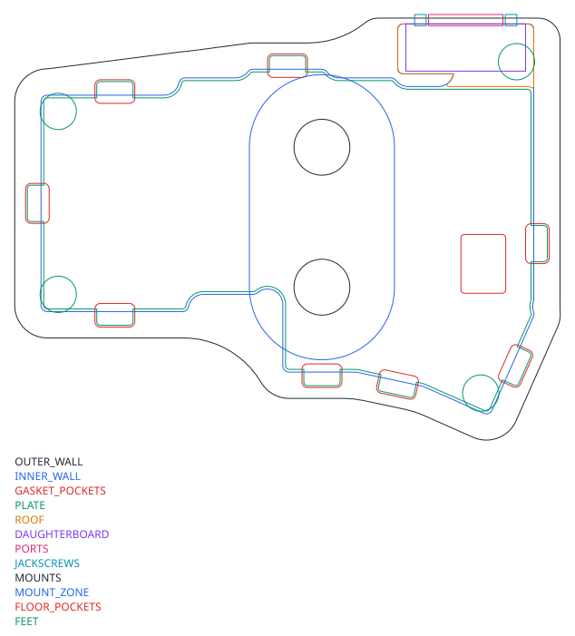

# Mechanical design

All numbers here come from `hardware/vgacorne/mechanical.py` (`STACK` and the
constants at the top). Change them there and re-run `generate.py mechanical`.

## Mounting concept

Hall-effect switches are **not soldered**. The plate holds them, and their
two plastic pegs locate them in the PCB. The sensor measures the distance
from the magnet in the stem to the PCB underside, so if the plate flexed
relative to the PCB, the rest position would drift.

So the build is two assemblies:

1. **Sandwich:** plate + PCB, bolted together with **seven M2 standoffs**
   (3.5 mm hex, 3.5 mm tall, brass). They sit in the 5 mm gaps between switch
   bodies, and the positions are shared by the PCB, plate and foam
   (`geometry._STANDOFFS`).
2. **Case:** CNC aluminium top frame + bottom tray. The sandwich floats between
   them on **gaskets** around eight plate tabs.

Flexing the gaskets moves the whole sandwich, not the magnet-to-sensor
distance, so you get gasket feel without the actuation point wandering.

## Stack-up

Heights are from the underside of the case.

| z (mm) | Surface |
|---|---|
| 0.0 | case underside |
| 3.0 | floor top (3.0 mm floor) |
| 3.0 – 6.5 | case foam, 3.5 mm (poron sheet or silicone pad) |
| 7.0 | PCB underside (tallest part below it: USB-C, 3.3 mm) |
| 8.6 | PCB top |
| 12.1 | plate underside (MX spec: plate top is 5.0 mm above the PCB top) |
| 13.6 | plate top |
| 14.0 – 16.6 | MCU module (inner column): 5.4 mm connector stack, 1.0 mm board, 1.6 mm LQFP |
| 17.1 | underside of the 1.5 mm roof over the inner column (0.5 mm above the module) |
| 18.6 | top of case (frame 5 mm above the plate) |

The frame height is set by the inner column: the VGA pocket needs more than the
DE-15's 12.55 mm flange (it gets 14.1 mm), and the module needs 8.0 mm above
the PCB (it gets 8.5 mm).
For a typing angle, keep these heights at the front and raise the back by
`depth × tan(angle)`. The case is 109 mm deep, so 5° adds about 9.5 mm.

## Poron or silicone

Every soft layer has its own DXF. Either material fits the same pockets;
silicone is springier, poron is more muted.

| Layer | File | Poron | Silicone |
|---|---|---|---|
| Gaskets (above and below each plate tab) | tabs in `plate-*.dxf`, pockets in `case-plan-*.dxf` | 3 mm PORON strips, 10 mm wide | 3 mm silicone strip or "sock" (≈ Shore 30–40A) |
| Case foam (under the PCB) | `foam-case-*.dxf` | 3.5 mm PORON sheet | 3.5–4 mm poured or cut silicone pad (≈ Shore 10–20A) |
| Plate foam (optional, between plate and PCB) | `foam-plate-*.dxf` | 3.5 mm PORON | 3.5 mm silicone |

- Aim for about 25 % gasket compression when the case is closed. Tune it with
  strip thickness, not by changing the pockets.
- Leave the 0.5 mm air gap above the case foam (`foam_gap`). Foam that
  touches the PCB preloads the gaskets and kills the flex.
- The case foam has reliefs for the connectors and buttons (read from the PCB
  file) and for the standoff screw heads.
- **Magnetics:** foams, silicone, aluminium, brass and FR4 are all fine.
  **Don't use a steel plate or steel weights.** Use brass for weights and
  standoffs. Any small static field distortion (e.g. stainless screws) is
  calibrated out, but brass or titanium M2 screws near the sensors are nicer.

## Plate

- `plate-left.dxf` / `plate-right.dxf`: 14.0 mm switch cutouts (0.3 mm
  corner radius), 2.2 mm standoff holes, eight 10 × 4.5 mm gasket tabs. The
  plate stops at the keys: the inner tab under it is where the MCU module plugs
  in.
- Aluminium 5052 or 6061 at 1.5 mm, waterjet/laser. POM or PC for a softer
  bottom-out.
- **FR4:** `hardware/mechanical/plate-{left,right}/*.kicad_pcb` are
  board-outline-only KiCad projects. Order them at 1.5 mm with the PCBs.
- Like the Corne, the 1.5u thumb key needs no stabiliser.

## Case (CNC aluminium)

`case-plan-*.dxf` layers:

| Layer | Meaning |
|---|---|
| `OUTER_WALL` | outside of the case (5 mm walls, 3 mm outside radius) |
| `INNER_WALL` | cavity: PCB outline + 0.75 mm, including the inner tab and the daughterboard pocket |
| `GASKET_POCKETS` | tab pockets (tab + 0.5 mm): gasket seat in the tray below, frame above |
| `PLATE` | plate outline with tabs, for reference |
| `DAUGHTERBOARD` | plan-view envelope of the vertical VGA board |
| `MCU_MODULE` | the plug-in MCU module on the inner tab (under the roof) |
| `PORTS` | DE-15 shell cutout (inner wall) and USB-C opening (back wall, left half) |
| `JACKSCREWS` | two Ø3.2 mm holes through the wall for the 4-40 screwlocks, 24.99 mm apart |
| `WALL_RELIEF` | outside counterbore that thins the wall to 1.6 mm around the DE-15 |
| `FLOOR_ACCESS` | Ø3 mm floor holes under the BOOT and RESET buttons (left half) |

Suggested split: the **bottom tray** carries the floor, walls up to the lower
gasket seat and the lower tab pockets. The **top frame** carries the bezel
around the keys, the upper tab pockets and the **1.5 mm roof over the inner
column**, which covers the VGA pocket and the MCU module and keeps the module
seated in its socket. Join them with M3 screws from below
through the wall thickness (6–8 places), clear of the gasket pockets. Each
half is about 150 × 109 mm.

### VGA daughterboard

 

- 33 × 13 mm board standing on edge against the inner wall. The vertical DE-15F
  is on the front; the back carries 10 solder pads for a **10-pin JST-SH
  pigtail** plus the cable-variant jumpers. The pigtail plugs into `J3` on
  the half's PCB, which faces into the pocket.
- The DE-15's **4-40 screwlocks** clamp the connector flange to the inside of
  the wall. That's the only fixing, and it sends cable forces straight into
  the case.
- A plug only mates fully through a thin panel, so thin the 5 mm wall to
  **1.6 mm** around the port (`WALL_RELIEF`, from outside, about 35 × 17 mm).
- Centre the shell about 7 mm above the floor top: the flange (12.55 mm) sits
  between the floor and the roof, with 14.1 mm clear.
- Use the panel cutout from your connector's datasheet. `PORTS` is a
  19.2 mm-wide placeholder for shell size E.

### MCU module

- 19.2 × 16.8 mm module on a 2×12, 1.27 mm SMD socket on top of the inner
  tab (see [architecture.md](architecture.md#mcu-modules)). The top of the
  module is 8.0 mm above the PCB; the roof is 0.5 mm above that. A thin foam
  pad on the underside of the roof stops rattle.
- To swap it: open the case, lift the module straight up, plug in the other
  one, then flash its firmware.

### USB-C (left half)

The receptacle is on the PCB underside at the top edge of the inner tab. Its
centre is about 5.4 mm above the case underside. Cut about 11 × 6 mm through
the wall so the floating sandwich can move ±0.5 mm, and add an outside recess
of about 12.5 × 7 mm if your cable's overmould is chunky.

## What to model next

A parametric 3D case (e.g. build123d or FreeCAD) can extrude the case-plan
layers directly:

1. Floor: `OUTER_WALL`, 3 mm, minus `FLOOR_ACCESS`.
2. Walls: `OUTER_WALL` − `INNER_WALL`, up to 18.6 mm.
3. Tab pockets at the plate height, split between tray and frame.
4. 1.5 mm roof over the inner column (VGA pocket + MCU module). Port cutouts and relief.
5. Optional wedge for a typing angle, brass weight pocket, tenting-leg inserts.
