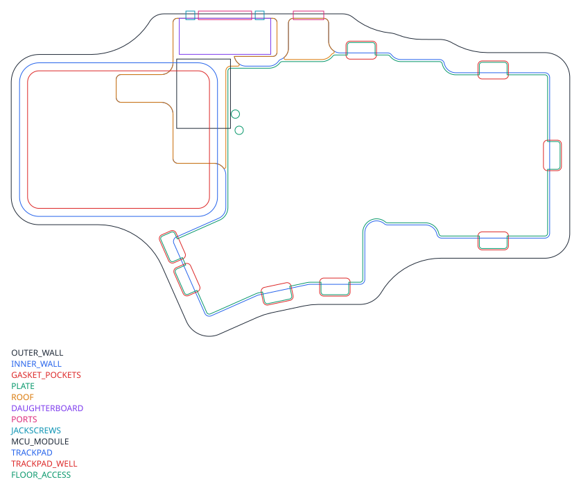
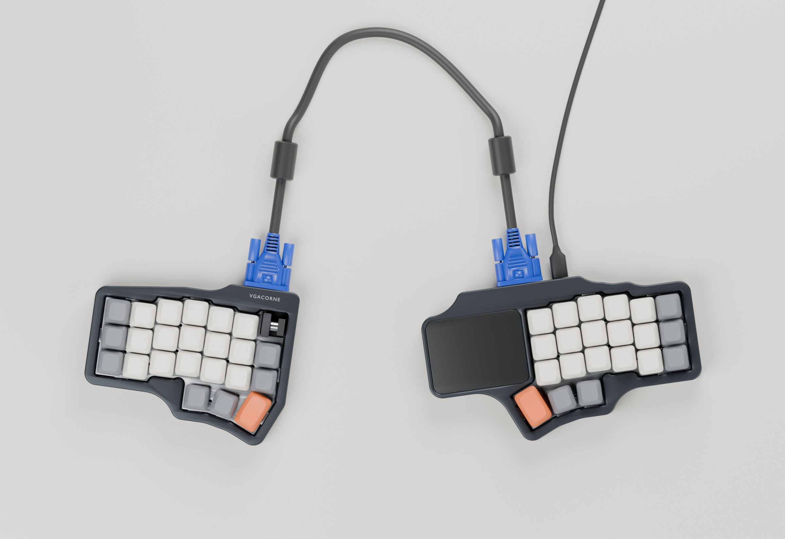
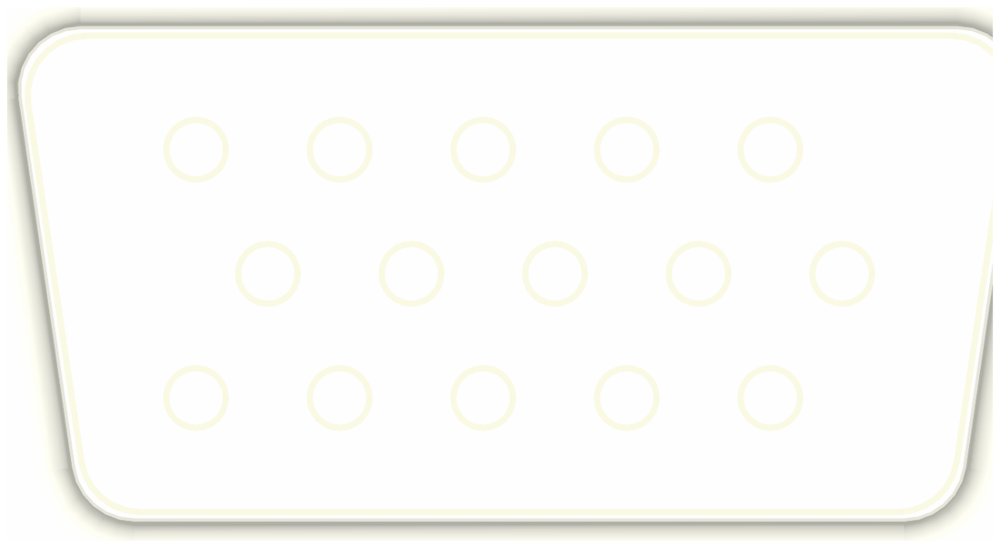
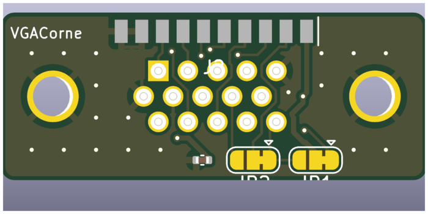

# Mechanical design

All numbers here come from `hardware/vgacorne/mechanical.py` (`STACK` and the
constants at the top). Change them there and re-run `generate.py mechanical`.

## Mounting concept

Hall-effect switches are **not soldered**. The plate holds them, and their
two plastic pegs locate them in the PCB. The sensor measures the distance
from the magnet in the stem to the PCB underside, so if the plate flexed
relative to the PCB, the rest position would drift.

So the build is two assemblies:

1. **Sandwich:** plate + PCB, bolted together with **M2 standoffs**
   (3.5 mm hex, 3.5 mm tall, brass): seven on the right half, eight on the
   left, whose mouse column gets its own. They sit in the gaps between switch
   bodies, and the positions are shared by the PCB, plate and foam
   (`geometry._STANDOFFS`).
2. **Case:** CNC aluminium top frame + bottom tray. The sandwich floats between
   them on **gaskets** around eight plate tabs.

Flexing the gaskets moves the whole sandwich, not the magnet-to-sensor
distance, so you get gasket feel without the actuation point wandering.

## Stack-up

Heights are from the underside of the case.

| z (mm) | Surface |
|---|---|
| 0.0 | case underside (the printed build's floor goes 2 mm lower) |
| 2.5 – 3.5 | floor pockets under the USB-C and the encoder's pins (`FLOOR_POCKETS`) |
| 3.5 | floor top (3.5 mm floor) |
| 3.5 – 5.0 | case foam, 1.5 mm PORON, then 1 mm of air to the parts above it |
| 3.5 – 6.5 | bosses for the two 1/4"-20 mounts, stopping 1 mm under the PCB |
| 6.0 | underside of the parts over the foam: sensors, muxes, regulators (up to 1.45 mm) |
| 7.5 | PCB underside (the USB-C hangs 3.26 mm below it, over a foam relief and a floor pocket) |
| 9.1 | PCB top |
| 12.6 | plate underside (MX spec: plate top is 5.0 mm above the PCB top) |
| 14.1 | plate top |
| 13.4 – 18.1 | trackpad module, its connector and the FFC fold, in their well (right half) |
| 9.1 – 11.8 | MCU module (under the trackpad): soldered flat, 1.0 mm board, 1.6 mm LQFP |
| 14.2 – 19.2 | encoder body top (flush with the plate) and the ~7 mm collar round its shaft (left half) |
| 19.6 – 31.1 | encoder knob (left half): clears the collar, top about 2 mm above the keycaps |
| 17.6 | underside of the 1.5 mm roof over the VGA bay and USB-C ear |
| 18.1 – 19.1 | trackpad overlay, flush with the top (right half) |
| 19.1 | top of case (frame 5 mm above the plate) |

The frame height is set by the parts under the roof: the VGA bay needs more
than the DE-15's 12.55 mm flange (it gets 14.1 mm). The MCU module is 2.7 mm
tall and sits 1.6 mm under the trackpad's well.
For a typing angle, keep these heights at the front and raise the back by
`depth × tan(angle)`. The case is 116 mm deep, so 5° adds about 10 mm.

## Foam and gaskets

Every soft layer has its own DXF. Use **PORON** (Rogers' open-cell
polyurethane foam) for all three layers.

| Layer | File | Use | Thickness | Alternatives | Avoid |
|---|---|---|---|---|---|
| **Gaskets:** a strip above and below each plate tab, 10 × 4.5 mm, 16 per half | tabs in `plate-*.dxf`, pockets in `case-plan-*.dxf` | **PORON 4701-30** (Very Soft, 320 kg/m³; 25 % CFD about 35 kPa) | 3.18 mm (Rogers' standard 0.125") | Softer: Rogers Inoac **LE-20**, 3.0 mm. Firmer: **PORON 4701-40**, 3.18 mm, or BISCO HT-800 silicone foam. | Solid silicone: 10–30× stiffer (table below). Silicone "socks" would need different tabs and cast 20A parts. |
| **Case foam:** on the floor under the PCB | `foam-case-*.dxf` | **PORON** 4701-30 or -40 at 1.57 mm, or LE-20 sheet, adhesive on one side | 1.5 mm | 2 mm EVA, which is cheap | Anything that reaches the parts: a 2 mm sheet plus tolerance and adhesive leaves only about 0.3 mm of air. A solid silicone pad: heavy, overkill. |
| **Plate foam** (optional): between plate and PCB | `foam-plate-*.dxf` | **PORON LE-20** 3.5 mm plate-foam sheet, or 4701-30 at 3.18 mm, which leaves 0.3 mm | ≤ 3.5 mm | 3.5 mm EVA cut from the DXF by a service | Anything thicker than the 3.5 mm gap: 10 % oversize pushes plate and PCB apart with roughly 50–90 N per half, which can bow the PCB and shift the Hall readings. Firm EVA. |
| **Switch pads** | – | **None** | – | – | IXPE/PE pads: the switches aren't soldered, so a pad pushes each one up against its plate clips, and the rest heights vary key to key. |
| **Feet** | `FEET` in `case-plan-*.dxf` | stick-on rubber or silicone bumpers, about 10 mm across | – | – | – |

**Gasket options.** The figures are for 16 strips of 45 mm² squeezed 25 %.
- **Case clamp:** the force on the case screws. The strips above and below each
  tab work in series through the tab, so it's half the sum of all 16.
- **Flex:** for a 5 N bottom-out in the middle of the keys, and on a corner key.

| Option | Grade | 25 % CFD | Per strip | Case clamp per half | Flex, middle / corner |
|---|---|---|---|---|---|
| **Use** | PORON 4701-30-20125-04 (3.18 mm) | 35 kPa (21–55) | 1.6 N | about 13 N | 0.15 / 0.44 mm |
| Softer | Rogers Inoac LE-20 (3.0 mm) | 20 kPa | 0.9 N | about 7 N | 0.26 / 0.77 mm; a hard corner press lets the top strip go slack |
| Firmer | PORON 4701-40-20125-04 (3.18 mm) | about 80 kPa | 3.6 N | about 29 N | 0.07 / 0.19 mm |
| Don't | solid silicone, Shore 30–40A, 3 mm | – | 18–46 N | 140–370 N | almost none; loads a printed case heavily |

- **Squeeze:** the pockets are drawn for 3.18 mm strips at 25 %. A 3.0 mm LE-20
  strip is squeezed about 20 %, so it's a little softer than its row says.
- **Thickness tolerance:** foam thickness is ±10 %. Measure your sheet, and tune
  with strip thickness, not by changing the pockets.
- **Adhesive:** put PSA (pressure-sensitive adhesive) on the case side only. It
  adds 0.05–0.13 mm.

**Buying.** Rogers itself sells big rolls, and gives samples of up to 10 sheets
of 8.5 × 11 in per grade (ask solutions@rogerscorp.com). Small amounts:

| Item | Source | Price |
|---|---|---|
| LE-20 strips, 25 × 4.5 × 3 mm, sold as "stickers" (cut each to 10 mm) | KPrepublic | $3.90–5.40 per 5-pack (snippet) |
| LE-20 strip, 80 × 4 × 3 mm | MaxCustom | €3.55 each |
| LE-20 sheets, 1 / 2 / 3 mm | SwagKeys | about $5.50 (snippet) |
| PORON 2 or 3 mm sheet, 17 × 5 in | Thock King | $6.95 (snippet) |
| KBDfans "module foam", 3.5 mm PORON plate foam with adhesive | KBDfans | ? |
| 4701-40, 1/8 in with PSA, 12.4 × 9.4 in, box of 10 | eBay surplus | $17.95 + shipping (snippet) |
| 4701-30 / 4701-40 rolls, with or without PSA | iTapeStore, LGS Technologies | $120+ minimum |

**Cutting:**

| Layer | How |
|---|---|
| Gaskets | By hand: 10 × 4.5 mm pieces from strips or sheet, with a printed stop jig. No DXF needed. |
| Case foam | Print `foam-case-*.dxf` at 1:1 (check a 50 mm square first), tape it to the release liner and cut with a fresh blade and a steel rule, in several light passes. A Cricut Maker (up to 2.4 mm) or Silhouette Cameo 5 (up to 3 mm) cuts it from the DXF. |
| Plate foam | PORON: a Cameo, or by hand with a printed 14 mm jig for the switch holes and leather punches for the standoffs. EVA: send the DXF to CustomKBD, Upgrade Keyboards or Ponoko. |

- **Don't laser-cut PORON or EVA at a makerspace.** Polyurethane gives off
  hydrogen cyanide, and most makerspaces ban both.
- **Don't laser-cut silicone:** it chars. Use a die or waterjet.
- **When preparing a DXF for a service,** add 0.2–0.3 mm round switch holes and
  standoffs.

**Fit rules:**
- **Clearance:** the case foam must never touch the PCB or the parts under it.
  If it does, it preloads the gaskets and kills the flex. Keep the 1 mm of air
  (`foam_gap`); the parts hang 1.5 mm below the PCB (`bottom_parts`). Thicker
  foam needs a taller case.
- **Reliefs:** the case foam has reliefs for the connectors and buttons (read
  from the PCB file), the standoff screw heads and the mount bosses.
- **Magnetics:** foams, silicone, aluminium, brass and FR4 are all fine.
  **Don't use a steel plate or steel weights.** Use brass for weights and
  standoffs. Any small static field distortion (e.g. stainless screws) is
  calibrated out, but brass or titanium M2 screws near the sensors are nicer.
  - **No magnets under the case.** A MagSafe tenting stand's magnet sits 7–9 mm
    under the sensors. It shifts the keys above it by about a full keypress
    whenever it's attached or removed ([mounting.md](mounting.md#why-not-magsafe)).
  - A steel tripod screw in the 1/4"-20 sockets is about 12 mm from the
    nearest sensor and unmagnetised, so it should be negligible. Check the key
    readings in hmkconf's debug view the first time you mount a half.

## Plate

- `plate-left.dxf` / `plate-right.dxf`: 14.0 mm switch cutouts (0.3 mm
  corner radius), 2.2 mm standoff holes, eight 10 × 4.5 mm gasket tabs. On the
  right half the plate stops at the keys: the trackpad sits over the inner
  column beside it, with the MCU module under it and the VGA bay behind. On the left half
  it covers the mouse column too, including a switch cutout for the rotary
  encoder.
- Aluminium 5052 or 6061 at 1.5 mm, waterjet/laser. POM or PC for a softer
  bottom-out.
- **FR4:** `hardware/mechanical/plate-{left,right}/*.kicad_pcb` are
  board-outline-only KiCad projects. Order them at 1.5 mm with the PCBs.
- Like the Corne, the 1.5u thumb key needs no stabiliser.

## Case (CNC aluminium)

`case-plan-*.dxf` layers:

| Layer | Meaning |
|---|---|
| `OUTER_WALL` | outside of the case: one smooth profile, with a flat back face at the ports |
| `INNER_WALL` | cavity: PCB outline + 0.75 mm, plus the VGA bay |
| `GASKET_POCKETS` | tab pockets (tab + 0.5 mm): gasket seat in the tray below, frame above |
| `PLATE` | plate outline with tabs, for reference |
| `ROOF` | where the top frame is a 1.5 mm roof: over the tab, the VGA bay and the USB-C ear |
| `DAUGHTERBOARD` | plan-view envelope of the vertical VGA board |
| `MCU_MODULE` | the soldered MCU module on the tab, under the trackpad |
| `PORTS` | DE-15 shell cutout and USB-C opening (right half), through the back face |
| `JACKSCREWS` | two Ø3.2 mm holes through the back face for the 4-40 jackscrews, 24.99 mm apart |
| `FLOOR_ACCESS` | Ø3 mm floor holes under the BOOT and RESET buttons (right half) |
| `FLOOR_POCKETS` | 1 mm pockets in the floor top under the USB-C (right half) and the encoder's pins (left half) |
| `TRACKPAD` | counterbore for the trackpad's overlay, 1.0 mm deep (right half; TPS65: 55.4 × 71.4 mm) |
| `TRACKPAD_WELL` | well under it for the pad module and FFC, 4.7 mm deeper; it opens into the cavity over the tab and the PCB tongue |

Each half is a **bottom tray** and a **top frame**, split at the plate's
underside (see [3D case](#3d-case) below). The tray carries the floor, the walls
and the lower tab pockets. The frame carries the bezel around the keys, the
upper tab pockets and the **1.5 mm roof** (`ROOF`), which covers the VGA bay,
the tab and the USB-C ear. Eight M3 screws per half come up from below through
the wall thickness, clear of the gasket pockets. The left half is about
150 × 116 mm. The right half is 202 × 116 mm with the TPS65 trackpad (171 mm
with the 40 mm Cirque).

Milling:

- **Outside:** one continuous profile. No concave radius is under 25 mm, and
  the convex corners are at least 6 mm, so a large cutter can finish it in a
  single pass. The walls are 7.25 mm thick, with at least 3 mm behind every
  gasket pocket. They don't bulge around each pocket.
- **Back face:** flat and 1.6 mm thick behind the VGA bay and USB-C, so both
  plugs mate fully. The ports are plain through-cuts from one side setup; no
  counterbores are needed.
- **Inside:** no radius under 1.5 mm (a 3 mm end mill). The inner side's
  gasket pocket is on the 1.5u thumb key's inner edge on the right half (below
  the trackpad) and on the mouse column beside M1 on the left.

### VGA daughterboard

 

- 33 × 13 mm board standing on edge in the **bay** at the inner-back corner,
  behind the inner column and column 5, with the DE-15 facing out of the back.
  The cable leaves backwards, away from your hands and out of the gap between
  the halves.
- The bay starts 4.5 mm further back than column 5 needs
  (`geometry.BAY_BACKSET`). That room is what lets the trackpad sit right
  beside Y/H/N; both halves share it, so their backs line up.
- The vertical DE-15F on the front is an **Amphenol FCI 10090929-S154XLF**:
  4-40 clinch nuts with board locks. The footprint is KiCad's vertical HD-15
  with the 1.2 mm pin holes and 3.1 mm board-lock holes Amphenol asks for
  (`lib/vgacorne.pretty`).
- Solder its board locks: they tie the shell to GND, and the jackscrews tie
  the case to the shell.
- The back carries 10 solder pads for a **10-pin JST-SH pigtail**, plus the
  cable-variant jumpers. Clip the DE-15's pin tails to about 1.5 mm first:
  they come through on the same side as the pads.
- The board sits about 6.1 mm (±0.3) behind the flange face on Amphenol's
  drawing. That drawing doesn't make clear which flange face it measures
  from, so check it on the first part: the 13 mm envelope leaves about
  3–4 mm for the pigtail's bend. The pigtail plugs
  into `J3`, which sits on the edge of the inner tab directly in front of the
  board, so a short (~5 cm) pigtail is enough.
- Two **4-40 female jackscrews** (Keystone 7229: 0.187" hex, 0.25" stud) go
  through the back face into the clinch nuts. They clamp the flange to the
  inside of the wall; that's the only fixing, and it sends cable forces
  straight into the case. The cable's thumbscrews thread into them.
  - A board-lock part can stop a long stud, so use a 0.25" one.
  - Keystone's figures come from distributor listings; check that the stud
    pulls the flange tight before it bottoms.
- The back face is 1.6 mm thick here, so the plug mates fully without a relief.
- Centre the shell about 7 mm above the floor top: the flange (12.55 mm) sits
  between the floor and the roof, with 14.1 mm clear.
- `PORTS` has the standard rear-mount cutout for shell size E, 20.5 × 11.4 mm
  (CECC 75 301-802); check it against your connector's datasheet.
- At full mating the plug's shell reaches about 1 mm into the 1.6 mm wall.
  That is the most D-sub makers allow with standard hardware, so the
  jackscrews' hex must be no taller than 4.8 mm (0.189"), or the plug won't
  seat. Keystone 7229's is 0.187".

### Trackpad (right half)

`hardware/vgacorne/trackpad.py` picks the pad. These notes describe the
default, the Azoteq TPS65; the 40 mm Cirque gets a round pocket on the same
principle.

- **Placement:** landscape, right beside Y/H/N over the inner column, so the
  index finger slides straight onto it. It spans the three rows: the moved VGA
  bay sets how far back it can go and the tilted 1.5u thumb key how low, which
  puts its middle about 3 mm behind the H row. It keeps 3 mm of aluminium to
  the keys, the VGA bay and the outside edge. The MCU module sits partly under
  its well, 1.6 mm below it.
- **Stack:**
  - The top is a 1 mm glass or acrylic overlay, 71 × 55 mm (the module plus
    3 mm all round) with about 7 mm corner radii. It sits flush in the
    `TRACKPAD` counterbore.
  - The 2 mm module is bonded to it with its own adhesive, centred.
  - The module hangs in `TRACKPAD_WELL` (module + 0.3 mm), so there is no
    aluminium under or right beside its electrodes.
  - The well is 4.7 mm deep under the overlay, for the module, its 2 mm ZIF
    connector and the fold of the FFC.
- **Cable:** the module's ZIF connector is 9.2 mm in from a long edge and
  25.3 mm from an end. Turn the module so that is the back edge and the end
  nearer the keys: the connector then sits right over J5 on a PCB tongue,
  and a short 6-pin 0.5 mm FFC folds down into it.
- J5 is bottom-contact and Azoteq doesn't say which side the pad's contacts are
  on. A paper mock-up decides between a same-side and an opposite-side FFC.
- **Case:** the outside profile wraps the pad with the same 25 mm minimum
  concave radius. The pad is why the right half is 51 mm wider than the left.

### Mouse column and rotary encoder (left half)

- The inner column beside T/G/B is exactly one key wide, in line with column
  5's rows: M1 (right click) beside T, M0 (left click) beside G and a rotary
  encoder beside B.
- **Encoder:** a Bourns PEC12R-4220F-N0024, upright with a 20 mm shaft, 24
  detents, no bushing and no push switch. Its 12.4 × 13.4 mm body stands on
  the PCB through an ordinary 14 mm switch cutout in the plate, like a key.
  Its body top is flush with the plate top.
  - KiCad's footprint for the bushing version (`-3x17F`) has the same pads.
    The `-4`'s mounting legs are narrower than the footprint's slots, so the
    signal pins locate it.
  - Its pins and legs come through about 3 mm: trim them to about 2 mm after
    soldering.
- **Knob:** 16 mm across and 11.5 mm tall, on the 6 mm D-flat shaft, pushed on
  to leave 2 mm above the shaft end.
  - Above the body, a ~7 mm collar round the shaft rises to 10.1 mm above the
    PCB. The flat runs from 13 mm to the shaft end at 20 mm.
  - The knob's underside clears the collar by 0.4 mm, and its D-bore (at least
    9.5 mm deep) grips the whole flat. Its top is about 2 mm above the keycaps.
  - A taller knob needs a recess at least 7.5 mm across underneath for the
    collar, or it sits higher.
  - It clears the left-click and B keycaps by 2 mm and the 1.5u thumb keycap by
    1.5 mm. A knob up to 17 mm across still leaves 1 mm.
- **Foam:** the plate foam has a switch-sized cut at the encoder, plus its
  pins. The case foam has a relief under its pins and legs, and the floor a
  1 mm pocket (`FLOOR_POCKETS`).
- **Standoff:** one extra M2 standoff between G, B, left click and the encoder,
  since the mouse column's plate would otherwise hang 20 mm off column 5.

### MCU module

- 19.4 × 25 mm castellated module, soldered flat onto landing pads J4 on top
  of the main PCB's tab, under the trackpad (see
  [architecture.md](architecture.md#mcu-modules)). It is 2.7 mm tall and
  1.6 mm below the trackpad's well, so the case needs no room for it. The
  back of the right half tapers from the keys, over the whole trackpad.
- A short PCB tongue from the tab reaches under the pad for its connector J5.
  It stays inside the pad's footprint.
- Changing module means desoldering it (hot air); the main PCB fits either.

### USB-C (right half)

The receptacle is on the PCB underside, on a small ear of the PCB that
reaches the back face behind column 4, beside the DE-15.
- **Position:** it overhangs the ear's edge by 0.46 mm, as HRO's drawing
  intends (`geometry.USB_OVERHANG`). That puts its face 1.9 mm inside the back
  face and its centre about 5.8 mm above the case underside (`USB_Z`).
- **Opening:** a fully seated plug's overmould stops about 0.45 mm short of
  the receptacle face (USB Type-C R2.5: a 6.65 mm plug in a 6.20 mm
  receptacle), so it goes ~1.4 mm into the 1.6 mm wall. The opening in `PORTS`
  is therefore 13.95 × 8.1 mm: the largest overmould the spec allows
  (12.85 × 7.0 mm) plus 0.55 mm all round for the floating sandwich. It is a
  plain through-cut.
- **Floor:** the shell hangs to 0.74 mm above the floor top, so the floor has a
  1 mm pocket under it (`FLOOR_POCKETS`), and gasket travel can't bottom it out.

## 3D case

`generate.py case` (`vgacorne/case3d.py`, needs build123d) extrudes the
case-plan layers into a tray and a frame per half, in two builds. Everything is
in `hardware/mechanical/`. The outlines are true lines and arcs, within 0.05 mm
of the 2D plan.

| Build | Files per half | For |
|---|---|---|
| `tapped` | `case-<side>-{tray,frame}-tapped.step`, plus a `.dxf` drawing of each part's holes and threads | aluminium: CNC 6061, or printed AlSi10Mg |
| `inserts` | `case-<side>-{tray,frame}-inserts.step` and `.stl` | FDM prints (PLA, ABS/ASA, nylon) with heat-set inserts |

| Part | Height | Contents |
|---|---|---|
| Tray | 0 – 12.6 mm | 3.5 mm floor with `FLOOR_ACCESS` holes and 1 mm `FLOOR_POCKETS`; walls (`OUTER_WALL` − `INNER_WALL`); lower tab pockets, 2.4 mm deep; two 1/4"-20 mounts in bosses; the lower part of the ports and both jackscrew holes |
| Frame | 12.6 – 19.1 mm | walls; upper tab pockets up to 16.5 mm; 1.5 mm roof over `ROOF`; the bezel opening round the plate; trackpad counterbore and well (right half); the upper part of the DE-15 cutout |

- **Seam:** at the plate's underside, so the tab sits in the frame's pocket and
  the lower gasket strip in the tray's.
- **Gaskets:** each pocket gives 6.27 mm for the 1.5 mm tab and two 3.18 mm
  PORON strips, which is 25 % compression ([Foam and gaskets](#foam-and-gaskets)).
- **Screws:** eight M3 × 12 button heads (ISO 7380) per half, from below,
  placed automatically on the wall's midline clear of the gasket pockets,
  ports and trackpad. The same places and screws in both builds.
- **Mounts:** two 1/4"-20 sockets per half for tripods, tenting heads and desk
  arms (see [Tenting and desk mounting](#tenting-and-desk-mounting)). Each sits
  in a 15.4 mm boss that rises from the floor to 1 mm under the PCB, in a
  spot its underside leaves clear (`geometry.mounts`). The PCB generator keeps
  parts out of these spots, the case foam has a relief round each, and the fit
  check fails if a part on the PCB moves onto one.
- **Weight**, in 6061: about 275 g for the left half and 405 g for the right
  (the `tapped` build).
- **Fit check:** `generate.py case` and `check` build what goes inside as solids
  and fail if any runs into the tray or frame:
  - the PCB, every part under it (from the board file) and the standoff screw heads;
  - the plate with its tabs;
  - the daughterboard;
  - the MCU module;
  - the trackpad overlay and module;
  - the encoder, its collar and the knob.

  The bodies are inset 0.05 mm, so parts that touch by design pass: the DE-15
  flange against the back wall, the plate on the seam.

### The two builds

| | `tapped` (aluminium) | `inserts` (FDM) |
|---|---|---|
| Frame screw holes | 2.5 mm drill, 5 mm deep, tapped M3 (about 3.5 mm of full thread) | 4.2 mm × 5 mm (CAD size) for an M3 × 4.0 insert: ruthex RX-M3Sx4.0, or CNC Kitchen M3 × 3 |
| Tray screw holes | 3.4 mm through, counterbore 6.0 × 4.5 mm | 3.5 mm through, counterbore 6.2 × 6.5 mm |
| 1/4"-20 mounts | #7 (5.1 mm) drill, 5.5 mm deep, tapped (4.5 mm of full thread) | 8.2 mm × 7.4 mm (CAD size) for a 1/4"-20 × 6.4 "short" insert (CNC Kitchen or ruthex) |
| Floor | 3.5 mm | 5.5 mm: 2 mm more underneath, so the 6.4 mm insert fits under the PCB |

Both meet ISO 1222 for the tripod socket: at least 5.5 mm deep with 4 mm of
full thread; tripod screws stand 4.5 mm proud. The printed floor is thicker all
over rather than in a pad round the mounts, because the rest of a padded floor
would overhang the print bed.

**Printing** (`inserts`):
- **Orientation:** print the tray floor-down and the frame upside down (top on
  the bed). Neither needs supports. The trackpad's counterbore ledge bridges
  2.7 mm.
- **Calibrate the holes first:** print a coupon with 4.0–4.3 mm and 8.0–8.4 mm
  holes. Printed holes come out about 0.2 mm under their CAD size.
- **Installing the inserts:** use an iron at about 225 °C for PLA and 265 °C for
  ABS/ASA (nylon about print temperature + 10–20 °C). Press them flush, never
  recessed. The frame's go in from the seam side, the mounts' from underneath.
- **Material:** PLA softens around 55–60 °C, so keep it out of a hot car. ASA or
  ABS is the better everyday choice. For nylon pick PA12: PA6 creeps and
  weakens when it absorbs water.
- **Edges:** turn on elephant-foot compensation; the bottom edges aren't
  chamfered.

**Aluminium** (`tapped`):
- **CNC** (JLCCNC, PCBWay, Xometry): none of them reads threads from a STEP
  file. Send each STEP together with its `.dxf`, which tabulates every hole and
  thread, and tick "threads" on the order. Ask for tapped holes to be masked
  when anodising. JLCCNC doesn't anodise threads under M5.
- **Printed AlSi10Mg (SLM):** JLC3DP doesn't offer aluminium; PCBWay and
  Xometry do. Printed holes come out undersize, so drill to the tap-drill size
  and tap afterwards. Use cutting taps, since the alloy is not ductile. Xometry
  takes thread and Helicoil callouts from the drawing.

Not modelled; tell the machinist or add them later:
- Edge breaks. The renders show 1.2 mm rounds on the outside edges; at least
  break all edges.
- The wordmark on the roof.
- Rubber feet. `FEET` in the case plan marks a spot near each corner, outside the
  mount zone and clear of the screw counterbores. Use stick-on feet about
  10 mm across.
- A typing-angle wedge, brass weights.
- Under the trackpad the tray is solid (the wall between the PCB and the
  outline, about 125 g). A pocket from below would lighten it.

### Tenting and desk mounting

Every tenting and mounting option uses the two 1/4"-20 sockets under each
half. It is the camera world's standard thread, shared by tripods, ball heads,
Arca-Swiss quick-release plates, desk clamps and arms.

- **Sockets:** front to back, in the column gap nearest the half's centre of
  mass. They are 38.6 mm apart on the left half and 38.2 mm on the right.
- **One socket** takes any single-screw tripod head.
- **Both sockets** take a two-screw Arca-Swiss plate, which stops the half
  twisting on the mount. That needs a slotted plate or rail, or Arca-Swiss's
  adjustable 28–40 mm plate. From then on every mount uses one Arca clamp.
- **Mount zone:** keep feet and labels out of the 40 mm-wide `MOUNT_ZONE` round
  the sockets, so a 38 mm plate seats flat.
- **The back face** stays clear in every setup. Run the VGA cable along the arm
  and clamp it there for strain relief.

Stands, ball heads, arms, trays and what each costs:
[mounting.md](mounting.md). The short version:
- **Tenting:** a SmallRig BUT2664 or Manfrotto PIXI ball head on one socket.
- **Above the desk:** a clamp and arm with an Arca quick release.
- **Under the desk or at the chair:** pole arms on the chair, or a wide
  keyboard-tray board with a clamp per half.
