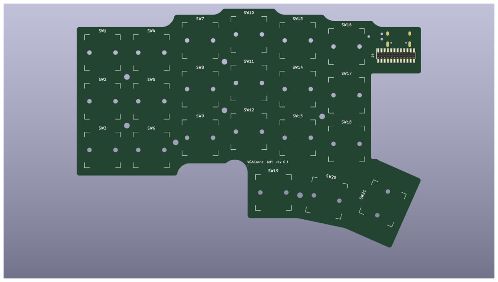

# VGACorne

A hall-effect split Corne (3×6 + 3) with a single MCU. The right half's analog
multiplexers are read over a VGA cable. This QMK keyboard is for the
**STM32F446RET6 MCU module**; the AT32F405 module runs libhmk instead.

* Keyboard maintainer: [antwang0](https://github.com/antwang0)
* Hardware supported: VGACorne rev 0.1 with the STM32F446 module
* Hardware availability: open source, see the VGACorne repository

Make example for this keyboard (after setting up your build environment):

    make vgacorne:default

Flashing example for this keyboard:

    make vgacorne:default:flash

See the [build environment setup](https://docs.qmk.fm/#/getting_started_build_tools) and the [make instructions](https://docs.qmk.fm/#/getting_started_make_guide) for more information. Brand new to QMK? Start with our [Complete Newbs Guide](https://docs.qmk.fm/#/newbs).

## Bootloader

Enter the bootloader in 3 ways:

* **Physical button**: hold BOOT (reachable through the case floor) while plugging in
* **Keycode in layout**: press `QK_BOOT` (adjust layer: hold both layer keys, then the top-left key)
* **Reset button**: hold BOOT, then press RESET

## Hall-effect keys

The matrix is analog (`he_matrix.c`); `he_wiring.h` and `keyboard.json` are
generated from the schematics by `hardware/generate.py firmware` in the
VGACorne repository. Connect the VGA cable before USB, or press `HE_CALB`,
with your hands off the keys. Rest values are learned in the first 500 ms.

| Keycode | Action |
|---|---|
| `HE_ACTU` / `HE_ACTD` | actuation point 0.1 mm deeper / shallower (default 1.5 mm) |
| `HE_RTTG` | rapid trigger on/off |
| `HE_RTSU` / `HE_RTSD` | rapid trigger less / more sensitive (default 0.3 mm) |
| `HE_CALB` | recalibrate every key |
| `HE_DBG` | with `CONSOLE_ENABLE = yes`: print raw values for `qmk console` |

Settings are saved to flash.
